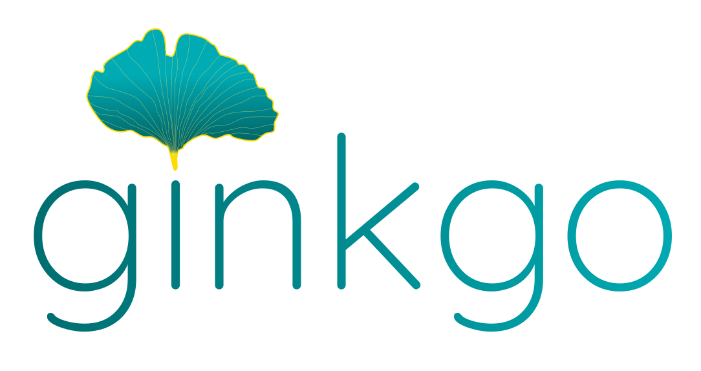

<p align="center"></p>

<p align="center"><a href="LICENSE"></a> <a href="pyproject.toml"></a> <a href="https://github.com/sanjaynagi/ginkgo/actions/workflows/tests.yml"></a> <a href="https://github.com/sanjaynagi/ginkgo/actions/workflows/quality.yml"></a> <a href="https://sanjaynagi.github.io/ginkgo/"></a></p>

Ginkgo is a scientific workflow orchestrator built for the 21st century.

- `@flow` and `@task()` — define workflows in plain Python, no DSL to learn
- An intuitive, aesthetic API built specifically for data science and bioinformatics
- natively dynamic workflows — expand workflows during runtime from resolved tasks
- content-addressed caching — never recompute what hasn't changed
- isolated environments — pixi or containers, per task
- agent-friendly — built from the ground up for workflows to be built and operated by AI agents
- cloud-native I/O — stream inputs directly from S3, GCS, or Azure and stage outputs back, without local copies
- deep observability — provenance and CLI tooling

## Documentation

📖 **[sanjaynagi.github.io/ginkgo](https://sanjaynagi.github.io/ginkgo/)**

It covers installation, quickstart, core concepts, environments, notebook tasks,
caching, CLI usage, and a canonical example workflow.

## Installation

### Quick install (curl)

Install the `ginkgo` CLI in one line. Requires [uv](https://docs.astral.sh/uv/getting-started/installation/)
to be installed:

```bash
curl -LsSf https://raw.githubusercontent.com/sanjaynagi/ginkgo/main/install.sh | sh
```

This installs `ginkgo` from `main` into an isolated environment via `uv tool
install`. Re-run the same command to upgrade.

### Pixi

For local development:

```bash
pixi install
pixi run test
pixi run typecheck
```

After `pixi install`, build the [uncoded](https://github.com/alimanfoo/uncoded)
symbol index used by AI coding tools (regenerated automatically by the
pre-commit hook, but useful to seed up front):

```bash
pixi run uncoded sync
```

If your workflows use Pixi-backed task environments, `pixi` must also be
available on `PATH` when you run them.

Run the CLI with either:

```bash
pixi run python -m ginkgo.cli --help
```

or:

```bash
ginkgo --help
```

### Editable install

If you prefer a plain Python environment:

```bash
pip install -e .
```

## Minimal Example

A population-genetics workflow that filters a VCF, computes per-population
allele frequencies, and renders a summary notebook.

```python
import numpy as np

from ginkgo import file, flow, notebook, shell, task

POPULATIONS = ["YRI", "CEU", "CHB"]


# shell task — runs bcftools in a subprocess
@task("shell", env="genomics_tools")
def filter_snps(vcf_path: file, min_maf: float) -> file:
    """Filter to biallelic SNPs above a minor-allele-frequency threshold."""
    output = "results/filtered.vcf.gz"
    return shell(
        cmd=(
            f"bcftools view -m2 -M2 -v snps -i 'MAF>={min_maf}' "
            f"{vcf_path} -Oz -o {output} && bcftools index {output}"
        ),
        output=output,
    )


# python task — uses scikit-allel, fanned out per population via .map()
@task()
def allele_frequencies(vcf_path: file, population: str) -> file:
    """Compute per-SNP alt-allele frequencies for one population."""
    import allel

    callset = allel.read_vcf(str(vcf_path), fields=["calldata/GT"])
    ac = allel.GenotypeArray(callset["calldata/GT"]).count_alleles()
    freqs = ac.to_frequencies()[:, 1]  # alt allele frequency

    output = f"results/af_{population}.npy"
    np.save(output, freqs)
    return file(output)


# notebook task — renders an HTML report from a Jupyter notebook
@task("notebook")
def population_structure(af_files: list[file], populations: list[str]) -> file:
    """Render an HTML population-genetics summary notebook."""
    return notebook("notebooks/population_structure.ipynb")


# flow
@flow
def main():
    filtered = filter_snps(vcf_path="data/chr22.vcf.gz", min_maf=0.05)
    af_results = allele_frequencies(vcf_path=filtered).map(population=POPULATIONS)
    return population_structure(af_files=af_results, populations=POPULATIONS)
```

Run it with:

```bash
ginkgo run flow.py
```

## Canonical Example

The docs and examples are centered on
[`examples/bioinfo`](examples/bioinfo), which demonstrates:

- Pixi-backed shell tasks
- a container-backed shell task
- `.map()` fan-out across samples
- a local Python aggregation task
- typed assets (`asset()`, `table()`) with data-quality checks
- downstream consumption via `file | AssetRef`

See the [assets guide](docs/site/guide/assets.md) for more on the asset system.

Run it with:

```bash
cd examples/bioinfo
ginkgo run
```

## Core CLI Commands

To confirm a workflow is wired correctly, run `ginkgo run --dry-run`: it previews
the plan for the entrypoint you actually run without executing any task body.
Validation workflows a project keeps under `tests/workflows/` are workflows too,
so they run by path: `ginkgo run tests/workflows/smoke.py`. See the
[CLI guide](docs/site/guide/cli.md).

- `ginkgo run`
- `ginkgo doctor`
- `ginkgo debug`
- `ginkgo init`
- `ginkgo inspect workflow`
- `ginkgo runs` (`runs ls`, `runs show`)
- `ginkgo history`
- `ginkgo query`
- `ginkgo export` (`export events`, `export manifest`)
- `ginkgo asset` (`asset ls`, `asset versions`, `asset inspect`, `asset show`)
- `ginkgo report`
- `ginkgo models`
- `ginkgo notebooks`
- `ginkgo secrets` (`secrets list`, `secrets validate`)
- `ginkgo cache ls`
- `ginkgo cache clear`
- `ginkgo cache prune`
- `ginkgo cache explain`
- `ginkgo env ls`

For full details on every command, see the [CLI reference](docs/site/guide/cli.md).

## Repository Layout

```text
ginkgo/
├── core/
├── runtime/
├── envs/
└── cli/
```

- `core/` contains the user-facing DSL
- `runtime/` contains evaluation, scheduling, caching, provenance, and value transport
- `envs/` contains execution backends
- `cli/` contains the `ginkgo` command-line interface

---

Ginkgo is licensed under the Apache License, Version 2.0. See
[`LICENSE`](LICENSE).
